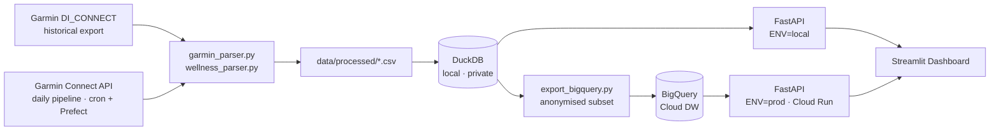

# Garmin Guard — Know your training load before race day, not after.


---

## Problem

Garmin tells you what you did. It doesn't tell you whether you're digging yourself into a hole before your next race.

Overtraining in the weeks before an event is one of the most common causes of injury and race-day underperformance — and it happens gradually, invisibly. The standard metric for catching it is the **Acute:Chronic Workload Ratio (ACWR)**: a ratio of your recent load (last 7 days) to your longer-term baseline (last 42 days). Stay between 0.8 and 1.3, and you're building fitness. Drift above 1.5, and injury risk spikes.

Garmin's native app shows you your past. It has no forward projection, no planned-workout integration, and no awareness of the physiological context that shapes how an athlete should actually train — including the menstrual cycle, which shifts recovery needs and optimal load by up to 25% across its phases.

This project fills that gap.

---

## How it Works

Garmin Connect is polled daily via a cron-scheduled Prefect pipeline (`src/flows/daily_pipeline.py`) that runs three stages in sequence: fetch from the Garmin Connect API → reload local DuckDB → push an anonymised subset to BigQuery. Activities, wellness signals (sleep, HRV, resting HR, menstrual cycle), and planned workouts are normalised into a local DuckDB database — the only place where sensitive data ever lives. A FastAPI layer abstracts both backends behind a single interface, and a Streamlit dashboard renders training load history, a 60-day ACWR projection, and wellness trends — with an optional menstrual cycle overlay throughout. A one-click refresh button in the dashboard sidebar triggers the same pipeline on demand, useful after an activity is recorded mid-day.



The API is dual-mode: `ENV=local` reads DuckDB; `ENV=prod` reads BigQuery. The dashboard talks to the API and behaves identically in both environments — no code change required between local development and production.

---

## Key Features

- **📊 ACWR dashboard with live risk zones** — colour-coded bands (under-load / optimal / caution / risk) built on standard TRIMP methodology (7-day and 42-day EWMA on daily TSS)
- **🔮 60-day forward projection** — actual load for the past 30 days + projected ACWR curve for the next 60 days, driven by planned workouts synced directly from Garmin Connect
- **🔴 Menstrual cycle overlay** — phase bands (Menstrual / Follicular / Ovulation / Luteal) rendered across every chart; auto-derived from wellness sync, no manual input
- **🧠 Cycle-aware training plan generator** — periodised BUILD/RECOVERY/TAPER macrocycle with an ACWR constraint loop; load is modulated per phase (−20% menstrual, +10% follicular, −25% late-luteal) and projected week-by-week before the plan is accepted
- **🔄 On-demand refresh** — a sidebar button in the dashboard triggers the full pipeline (Garmin sync → DuckDB reload → BigQuery export) via `POST /sync`, with live status polling and automatic cache invalidation when complete
- **🔒 GDPR-by-design** — GPS, HRV, sleep durations, menstrual data, and body weight never leave the local DuckDB file; BigQuery receives only anonymised aggregate performance signals
- **⚙️ Dual-mode API** — a single FastAPI codebase serves local DuckDB or BigQuery depending on one environment variable; switching environments requires zero code changes

---

## Tech Stack

| Category | Tool | Why |
|---|---|---|
| Data source | `garminconnect` + Garmin DI_CONNECT export | Official Garmin API for live sync; bulk export for historical backfill |
| Orchestration | Prefect | Lightweight Python-native scheduler; daily sync flow with no infrastructure overhead |
| Local storage | DuckDB 1.5 | Zero-config embedded OLAP database; fast analytical queries on CSV files with no server to manage |
| Cloud warehouse | BigQuery | Serverless scale for the anonymised production dataset; integrates cleanly with GCP Cloud Run |
| Backend API | FastAPI + Pydantic | Type-safe endpoints with automatic OpenAPI docs; Pydantic models drive both validation and training plan generation |
| Dashboard | Streamlit + Plotly | Rapid iteration on analytical UI; Plotly for fine-grained chart control (zone fills, overlay bands, dual axes) |
| Containerisation | Docker + GCP Artifact Registry | Separate images for API and dashboard; ARM64 builds for Cloud Run cost efficiency |
| Deployment | GCP Cloud Run | Serverless container hosting; scales to zero when not in use |

---

## Quickstart

```bash
# 1. Clone and install
git clone https://github.com/<your-handle>/garmin_guard.git
cd garmin_guard
make install

# 2. Set credentials
cp .env.example .env          # then fill in GARMIN_EMAIL, GARMIN_PASSWORD

# 3. Run the full data pipeline (parse DI_CONNECT export + sync API + load DuckDB)
make fetch_new_data

# 4. Start the API
make run_api_local             # http://localhost:8000/docs

# 5. Start the dashboard
make run_dashboard             # http://localhost:8501
```

Or launch both with one command: `make start_local`

---

## Project Structure

```
garmin_guard/
├── src/
│   ├── flows/
│   │   └── daily_pipeline.py  # Prefect flow: garmin sync → DuckDB → BigQuery (cron 07:00)
│   ├── ingestion/             # Garmin parsers and API sync
│   │   ├── garmin_parser.py   # DI_CONNECT export → activities_normalized.csv + training_load_features.csv
│   │   ├── wellness_parser.py # DI_CONNECT wellness exports → wellness_normalized.csv
│   │   ├── garmin_connect_fetch.py  # Live Garmin Connect API client
│   │   ├── sync_garmin_connect.py   # CLI wrapper: incremental or full backfill
│   │   ├── load_duckdb.py     # CSV → DuckDB tables
│   │   └── export_bigquery.py # DuckDB → BigQuery (anonymised subset)
│   └── training_plan/         # Cycle-aware plan generator
│       ├── models.py          # Pydantic data models
│       ├── cycle.py           # Menstrual phase modelling + load modifiers
│       ├── optimizer.py       # ACWR forward projection (week-by-week EWMA)
│       └── generator.py       # Periodised plan generation with ACWR constraint loop
├── package_folder/
│   └── api_file.py            # FastAPI app (dual-mode: DuckDB ↔ BigQuery)
├── dashboard/
│   └── streamlit_app.py       # Streamlit UI (4 tabs + sidebar filters)
├── tests/
│   └── test_schema_contract.py  # Schema contract tests (45 activity + 21 wellness columns)
├── data/
│   ├── raw/                   # Garmin DI_CONNECT exports (gitignored)
│   └── processed/             # Normalised CSVs + DuckDB file (gitignored)
├── Dockerfile                 # API production image
├── Dockerfile.streamlit       # Dashboard production image
└── Makefile                   # All pipeline, dev, and deployment commands
```

---

## Results

| Signal | Detail |
|---|---|
| Dataset | 263+ activities, Apr 2023 – Nov 2025 (2.5 years) |
| Training load | ATL/CTL/TSB computed daily via 7/42-day EWMA; TSS proxy (`duration × avg_hr / 3600 / 10`) used where Garmin omits TSS |
| ACWR constraint | Plan generator iterates up to 10 times per week to keep projected ACWR in the 0.8–1.3 optimal zone before accepting a weekly load target |
| Cycle modulation | 5-phase model with empirically grounded load multipliers: MENSTRUAL 0.80 · FOLLICULAR 1.10 · OVULATION 1.00 · LUTEAL_EARLY 0.90 · LUTEAL_LATE 0.75 |
| Schema reliability | Contract test suite validates 45 activity columns and 21 wellness columns against the canonical schema on every sync |
| Privacy posture | 8 sensitive field categories (GPS, HRV, menstrual, sleep durations, weight, bio-age, BMI, body battery) never leave the local DuckDB file |

The dashboard makes visible a question that previously had no answer: *given what I have planned, where will my training load be on race day?*

---

## What I'd Do Next

1. **Morning readiness classifier** — supervised ML model (gradient boosting or logistic regression) trained on cycle phase × HRV × sleep score × TSB to predict subjective feel and flag sessions that should be modified or skipped. The data is already collected; the label is the Garmin auto-evaluation score.

2. **Automated plan adjustment loop** — when ACWR drifts outside the optimal zone mid-plan (illness, missed sessions), automatically re-project and suggest revised upcoming sessions rather than requiring the athlete to intervene manually.

3. **Strava cross-validation** — reconcile activity records with Strava (prototype already in `notebooks/`) to catch activities recorded on the wrong device and fill gaps in the Garmin timeline.

---

## About

I'm a data professional with a background in analytics and engineering, and a runner training for distance events. This project exists because I wanted an honest answer to a real question — am I training correctly for this race? — and because building the answer was more useful than waiting for a product to solve it.

The stack is deliberately production-grade: an orchestrated ingestion pipeline, a typed API with two backend modes, containerised deployment to Cloud Run, and a privacy model I'd defend in front of a GDPR regulator. The menstrual cycle integration isn't an afterthought; it's a first-class data source that shapes training load the same way fatigue or fitness does, and it's handled with the same engineering rigour as everything else.
